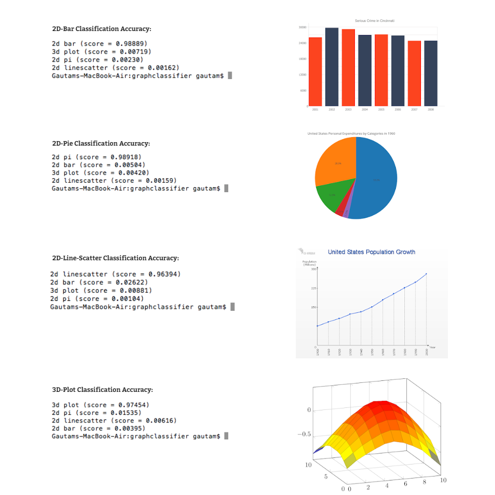

# Chart Image Classification Using Inception Model
An image classification program that uses Google's Machine Learning library, [Tensorflow](https://www.tensorflow.org/) and a pre-trained Deep Learning Convolutional Neural Network model called Inception.

This model has been pre-trained for the [ImageNet](http://image-net.org/) Large Visual Recognition Challenge using the data from 2012, and it can differentiate between 1,000 different classes, like Dalmatian, dishwasher etc.
The program applies Transfer Learning to this existing model and re-trains it to classify a new set of images.

This is a generic setup and can be used to classify almost any kind of image. This repository classifies four image data sets - 2D-line, 2D-Pie, 2D-Bar, 3D-Plots and returns a prediction score denoting the possibility of it being in a particular class.

<br/>

## Installation
Make sure you have [Python 3](https://www.python.org/downloads/) installed, then install [Tensorflow](https://www.tensorflow.org/install/) on your system, and clone this repo.

<br/>

## Usage 
(After the extraction of the Images from the PDF documents using [this.](https://www.google.com/url?q=https%3A%2F%2Fwww.systutorials.com%2Fdocs%2Flinux%2Fman%2F1-pdfimages%2F&sa=D))

### Prepare the image data sets ([Dataset](https://drive.google.com/open?id=15c5L_29GytEf60fj1zgO2d3zJZIOVXpp))
In order to start the transfer learning process, a folder named ``training_dataset`` needs to be created in the root of the project folder. This folder will contain the image data sets for all the subjects, for whom the classification is to be performed.

Create the ``training_dataset`` folder and add the images for all the data sets in the following manner -

```javascript
/
|
|
---- /training_dataset
|    |
|    |
|    ---- /2D-bar
|    |    2D-bar_1.jpg
|    |    2D-bar_2.jpg
|    |    ...
|    |
|    |
|    ---- /3D-Plot
|         3D-Plot_1.jpg
|         3D-Plot_2.jpg
|         ...
|
|     
```
This enables classification of images between the ``3D-Plot``, ``2D-Bar``, ``2D-Line`` and ``2D-Pie`` data sets.

> Make sure to include multiple variants of the subject, the more the images, the better is the result.

### Initiate transfer learning
Go to the project directory and run -

```javascript
$ bash train.sh
```
This script installs the ``Inception`` model and initiates the re-training process for the specified image data sets.

Once the process is complete, it will return a training accuracy somewhere between ``85% - 100%``.

The ``training summaries``, ``retrained graphs`` and ``retrained labels`` will be saved in a folder named ``tf_files``.

### Classify objects (Testing the Classifier)

```javascript
python3 classify.py
```

This opens up the file dialog using which you can select your input file image.

Once the input file is selected, the classifier will output the predictions for each data set. A prediction score between ``0.8`` to ``1`` is considered to be optimal.

<br/>

## Results
<br>

<br/>
